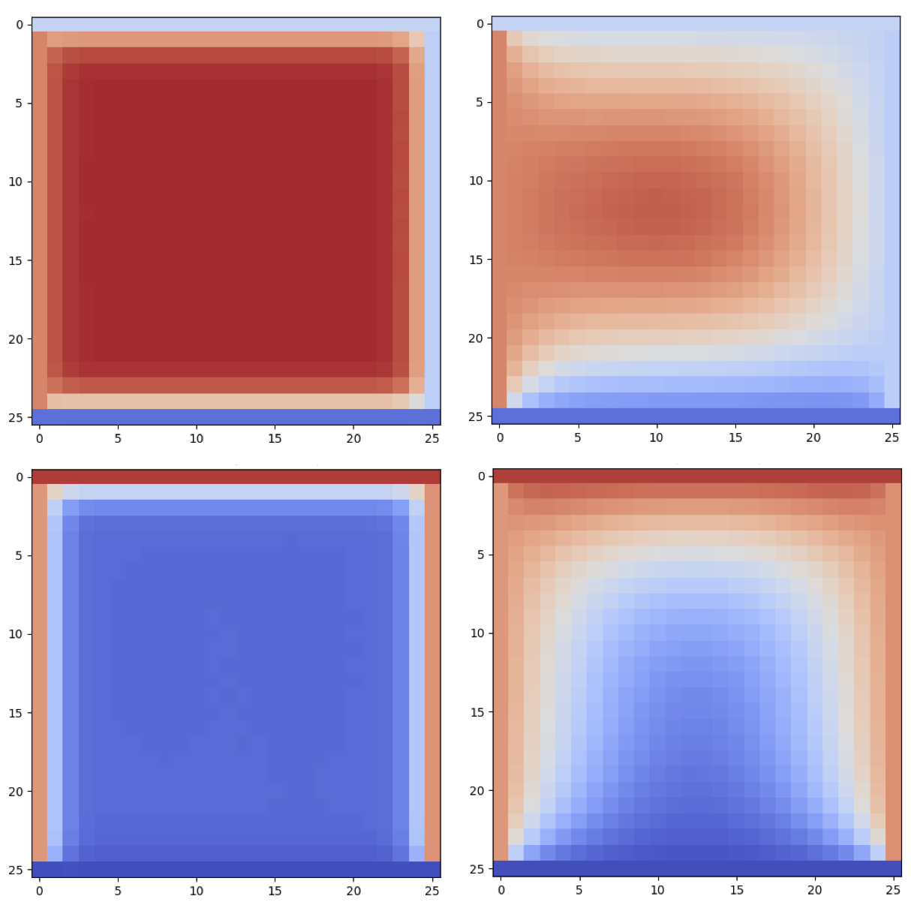

[](...)
[](...)

<p align="center">
  
  
</p>

# kbeta-transformer2d – *2-D Heat-Diffusion Transformer trained with Kourkoutas-β*  🌞🦎🚀📈

> **Research companion code for the upcoming paper**  
> “Kourkoutas-β: A Sunspike-Driven Adam Optimizer with Desert Flair.”  
> Published as [arXiv:2508.12996](http://arxiv.org/abs/2508.12996).
>
> This repository contains the full **2‑D data‑driven Transformer** workload that accompanies the optimiser  
> (see the separate [`kbeta`](https://github.com/sck-at-ucy/kbeta) repo), plus lightweight utilities for training, evaluation and visualisation.

---

## Table of Contents
1. [Why a 2-D Transformer?](#why-a-2-d-transformer)
2. [Model highlights](#model-highlights)
3. [Project layout](#project-layout)
4. [Installation](#installation)
5. [Quick start](#quick-start)
6. [Command-line interface](#command-line-interface)
7. [Training from scratch](#training-from-scratch)
8. [Using your own datasets](#using-your-own-datasets)
9. [Tests & linting](#tests--linting)
10. [Relation to Kourkoutas-β](#relation-to-kourkoutas-β)
11. [Learning-rate schedule behaviour](#learning-rate-schedule-behaviour)
12. [Citation](#citation)
13. [License](#license)

---

## Why a 2‑D Transformer?
* **Spatial‑temporal diffusion** appears in countless engineering problems (heat flow, pollutant transport, …).  
* A *purely data‑driven* Transformer offers a clean stress‑test for the optimiser.  
* Solver‑free physics loss: we embed the heat‑equation residual as an analytic term, no back‑prop through external PDE solvers is required.  
* The model scales to **512 × 512 meshes on Apple Silicon** while remaining <2 M parameters; perfect for rapid experimentation.

---

## Model highlights
*(what’s special about HeatDiffusion-Transformer-2D)*

* **Patch-wise attention on 2-D grids**  
  The input tensor is reshaped into *(T × H × W)* patches, letting the model treat every spatial location symmetrically while still exploiting MX-GPU tensor cores efficiently.

* **Dual masking modes**  
  *Causal* masks give an autoregressive model useful for long-horizon rollout tests; *block* masks allow full-context training when future frames are available.

* **RoPE (Rotary Positional Encoding) in the time dimension**  
  A single line swap lets you switch between vanilla sinusoidal encodings and RoPE, which markedly improves extrapolation beyond the training window.

* **Activation quantisation ready**  
  All dense / conv projections are implemented with `mlx.nn.quantize_lin`, giving you 8-bit weights on Apple Silicon **without** code changes.

* **Paper configuration ≈ 32 M parameters**  
  With 24 encoder layers, 16 heads, `embed_dim=512`, and `mlp_dim=256`, the model has about **32 M trainable parameters**—large enough to stress-test optimisers, yet compact enough to train on a single Mac Studio GPU (batch size 4, grid 25 × 25 × 401).

* **One‑liner optimiser swap**  
  The model inherits its optimiser object, so comparing Adam vs Kourkoutas‑β is literally *one* YAML entry.

---

## Project layout
```text
kbeta-transformer2d
├── src/kbeta_transformer2d/
│   ├── data.py              # mesh generation + loaders
│   ├── model.py             # Transformer & loss
│   ├── optim_factory.py     # Kourkoutas‑β wiring
│   ├── train.py             # training / eval loops
│   ├── plot_utils.py        # visualisations
│   └── demo_heat2d.py       # CLI entry‑point
├── configs/
│   └── heat2d.yml           # default hyper‑params
│   └── paper.yml            # paper   hyper‑params
└── README.md                # you are here
```

---

## Installation

### Option 1: PyPI wheels (end‑users)
If you only want to run the Transformer benchmark with the latest `kbeta`:

```bash
pip install kbeta-transformer2d
```

For dev tools and tests:

```bash
pip install "kbeta-transformer2d[dev]"
```

For exact reproducibility of the paper (MLX 0.26.3 + pinned deps):

```bash
pip install "kbeta-transformer2d[repro]"
```

---

### Option 2: Cloning the repo (researchers / contributors)

```bash
git clone https://github.com/sck-at-ucy/kbeta-transformer2d.git
cd kbeta-transformer2d
python -m venv .venv && source .venv/bin/activate
pip install -e ".[dev]"
```

This makes all configs and scripts editable for research use.

---

## Quick start
```bash
pytest -q   # ➜ all smoke‑tests should pass
```

---


## Command‑line interface

`demo_heat2d.py` is both import‑able **and** executable:

```bash
python -m kbeta_transformer2d.demo_heat2d <CONFIG.yml> [flags]
```

| element                 | purpose                                                                                                                     |
|-------------------------|-----------------------------------------------------------------------------------------------------------------------------|
| **CONFIG.yml**          | Path to a YAML file. If *relative* and not found, it is resolved inside the *installed* package (`…/configs`).             |
| `--epochs N`            | shorthand → `model_params.epochs=N`                                                                                         |
| `--seed N`              | RNG seed (NumPy + MLX)                                                                                                      |
| `--optimizer NAME`      | `adam95` \| `adam999` \| `kourkoutas`                                                                                       |
| `--kour_diagnostics`    | turn on verbose internal stats in **Kourkoutas‑β** (maps to `optimizer.kour_diagnostics=true`)                              |
| `--collect_spikes`      | enable collection of per‑layer **Sun‑spike** / **β₂** stats during training (maps to `tracking.collect_spikes=true`)        |
| `--viz`                 | enable expensive movie frames (maps to `io_and_plots.plots.movie_frames`)     |
| `--override KEY=VAL …`  | *generic* overrides using dot‑notation. May be repeated.                                                                    |

> **Notes on spike tracking**  
> To actually record Sun‑spike/β₂ you need **all** of: `--optimizer=kourkoutas`, `--kour_diagnostics`, **and** `--collect_spikes`. Enabling `--collect_spikes` auto-enables `--kour_diagnostics` as well.
> The windowing/plot stride is controlled via YAML (see below).

### Examples
```bash
# train 5 epochs with vanilla Adam‑(0.9,0.95)
python -m kbeta_transformer2d.demo_heat2d heat2d.yml \
   --epochs=5 \
   --optimizer=adam95 \
   --override storage.outdir="./OUTPUTS/run1"

# same as above but change mesh size and disable plotting
python -m kbeta_transformer2d.demo_heat2d heat2d.yml \
  --override geometry.dx=0.08 geometry.dy=0.08 \
  --override viz.enabled=false storage.outdir="./OUTPUTS/run2"  

# run with the *packaged* default config (no file in cwd needed)
python - <<'PY'
import subprocess, importlib.resources as res
cfg = res.files("kbeta_transformer2d.configs") / "heat2d.yml"
subprocess.run([
    "python", "-m", "kbeta_transformer2d.demo_heat2d",
    str(cfg),
    "--epochs=1",
    "--override", "storage.outdir=./OUTPUTS/run3"
])
PY
```

**Tip:** Use --override storage.outdir=... to redirect checkpoints/plots to a dedicated folder instead of cluttering the repo root.

### Example configuration (excerpt)
```yaml
seed: 0
geometry:
  rod_length: 1.0
  rod_width: 1.0
  dx: 0.04
  dy: 0.04
boundary_conditions:
  left_limits: [0, 1]
  right_limits: [0, 1]
  top_limits: [0, 1]
  bottom_limits: [0, 0.1]
thermal_diffusivity:
  alpha_limits: [0.01, 0.1]
model_params:
  start_predicting_from: 5
  batch_size: 4
  epochs: 10
  time_steps: 401
  num_heads: 16
  num_encoder_layers: 24
  mlp_dim: 256
  embed_dim: 512
  mask_type: block
learning_rate_schedule:
  5: 1.0e-3
  30: 5.0e-4
  40: 1.0e-4
  60: 1.0e-5
 120: 1.0e-6 
optimizer:
  name: adam999
  init_lr: 1.0e-3
  target_lr: 1.0e-5
  ramp_steps: 60000
tracking:
  collect_spikes: false     # set true to gather Sun‑spike / β₂ (if using kbeta)
  window: 500               # epochs per accumulation window
  plot_stride: 5000         # violin sampling stride (defaults to 10×window)
storage:
  outdir: null              # default = CWD; creates structured sub‑folders
io_and_plots:
  model_saving: false       # save a *final* full checkpoint at the end
save_checkpoints: true      # periodic checkpoints during training
save_interval: 10           # only used if save_checkpoints=true
```
*(see `configs/heat2d.yml` and configs/paper.yml for the full list)*

---
## Learning‑rate schedule behaviour

* If a `learning_rate_schedule` block is present in your YAML config, the model will **use that explicit step schedule** (this is how the published paper runs were done).  
* If no `learning_rate_schedule` is defined, the code will **fall back to a cosine schedule** controlled by `init_lr`, `target_lr`, and `ramp_steps` under the `optimizer` block.

---
### YAML quick-reference — common pitfalls 🔍

| what you want         | **write it like this**                                                                 | 👀 why it matters                                                |
|-----------------------|-----------------------------------------------------------------------------------------|------------------------------------------------------------------|
| **Booleans**          | `true`, `false` (‘yes’/‘no’ are fine too)                                               | YAML also treats `on`, `off`, `y`, `n` as booleans 👀. Avoid surprises by sticking to `true`/`false`. |
| **Disable a feature** | `some_flag: false` **not** `0`                                                          | `0` parses as an *integer*, not a boolean.                       |
| **Integers**          | `epochs: 100`                                                                           | No quotes -- unless you *really* need a string.                  |
| **Floats**            | `lr: 1e-3`  or  `0.001`                                                                 | Scientific notation is fine – YAML keeps full precision.          |
| **Avoid octal traps** | `mode: "0755"` (quotes!)                                                                | Bare `0755` is parsed as **octal** → -493 in Python.              |
| **Explicit null / off** | `momentum: null` (or `~`)                                                             | Empty value **isn’t** the same as `0`. Use `null` when you mean “unset”. |
| **Lists**             | Inline: `betas: [0.9, 0.999]` <br> Long form: <pre>betas:\n  - 0.9\n  - 0.999</pre>     | Both notations are equivalent — pick whichever is clearer in your config. |
| **Strings that look like numbers** | `activation: "gelu"`                                                       | Quotes stop YAML from trying to coerce things like `"1e6"` into floats. |
| **Env-vars / paths**  | `data_dir: "${HOME}/datasets"`                                                          | The braces/`$` need **quotes** or they’ll be treated as plain text and lose the `$`. |
| **Indentation**       | Two spaces per level (never tabs)                                                       | YAML is indentation-sensitive—tabs are a syntax error.            |
> **Tip:** If you’re ever unsure how YAML will parse a value, run  
> `python -c 'import yaml, sys, pprint, pathlib; pprint.pprint(yaml.safe_load(pathlib.Path("your.yml").read_text()))'`  
> to see exactly what Python receives.

---

## Training from scratch
```bash
python -m kbeta_transformer2d.demo_heat2d configs/heat2d.yml --epochs=30
```
Checkpoints (`.pkl` + `.safetensors`) and plots are written under a structured **OUTPUTS** folder. A typical layout looks like:

```text
OUTPUTS/
└── <run_label>_<strategy>_<mask>/
    ├── datasets/                 # saved MLX/NumPy arrays
    ├── checkpoints/              # periodic checkpoints (if enabled)
    ├── frames/                   # prediction frames / movies (optional)
    ├── sunspike_violin/          # violin + swarm plots
    ├── beta2_violin/
    ├── sunspike_density/         # value×epoch heat‑maps
    ├── beta2_density/
    └── mse/                      # block/AR MSE curves
```

**Checkpoint policy:**  
* If `save_checkpoints: false`, *no* periodic checkpoints are written (we internally treat `save_interval=None`).  
* If `true`, we save every `save_interval` epochs (default = 10).

---

## Using your own datasets
1. Provide your dataset as NumPy/MLX arrays.  
2. Adjust `geometry.*` in the YAML to match mesh resolution.  
3. Replace or extend `generate_datasets()` in `data.py` if needed.

---

## Tests & linting
```bash
pytest
ruff check .
mypy src
```

---

## Relation to Kourkoutas‑β
This repo **uses** the optimiser from `kbeta`; it does *not* re‑implement it.  
`optim_factory.py` wires `KourkoutasBeta` into the training loop.

---
### Further Reading & Related Resources 📚

| Resource | Why it Matters for **Kourkoutas‑β** & **kbeta‑transformer2d** |
|----------|--------------------------------------------------------------|
| **MLX Beyond Language (repo)**<br>https://github.com/sck-at-ucy/MLX_BeyondLanguage | Companion project that demonstrates how to scale MLX Transformer workloads *beyond* conventional language‑model settings (e.g. vision & physics). Provides many of the coding conventions, dataset helpers and plotting utilities reused here. |
| **MLX framework (Apple)**<br>https://github.com/ml-explore/mlx | The underlying tensor/NN library that powers both Kourkoutas‑β *and* the 2‑D Transformer. Understanding MLX’s compile/runtime model explains why adaptive optimisers like Kourkoutas‑β can hit full Metal GPU speed without custom CUDA kernels. |
| **Article: *Kourkoutas‑β: A Sunspike‑Driven Adam Optimizer with Desert Flair***<br>https://arxiv.org/abs/2508.12996 | The forthcoming paper describing Kourkoutas‑β in detail—mathematical derivation, convergence proofs and ablation studies. Read this to see why β₂ must be a dynamic *distribution* rather than a constant 0.999. |
| **kbeta (core optimiser)**<br>https://github.com/sck-at-ucy/kbeta | Stand‑alone Python package implementing Kourkoutas‑β. `kbeta-transformer2d` depends on `KourkoutasBeta` from the core repo; all optimiser‑level issues/PRs belong there. |
| **kbeta‑pinn3d (PINN benchmark)**<br>https://github.com/sck-at-ucy/kbeta-pinn3d | 3‑D Physics‑Informed Neural Network (PINN) workload that **collects β₂ “spike” diagnostics** during training. Useful if you want to compare how Kourkoutas‑β behaves on PDE‑constrained training vs. the fully data‑driven 2‑D Transformer shown here. |

---


## Citation

If you use this work, please cite both the **paper** and the **software archive**:

**Paper (arXiv preprint)**  
```bibtex
@article{Kassinos2025Kourkoutas,
  title   = {Kourkoutas-β: A Sunspike-Driven Adam Optimizer with Desert Flair},
  author  = {Stavros Kassinos},
  journal = {arXiv preprint arXiv:2508.12996},
  year    = {2025},
  url     = {https://arxiv.org/abs/2508.12996}
}
```

**Software (Zenodo archive, once minted)**  
```bibtex
@software{kassinos2025transformer2d,
  author       = {Stavros Kassinos},
  title        = {kbeta-transformer2d: 2-D Heat-Diffusion Transformer – Companion Code},
  year         = 2025,
  publisher    = {Zenodo},
  version      = {0.1.0},
  doi          = {10.5281/zenodo.xxxxxxx},
  url          = {https://doi.org/10.5281/zenodo.xxxxxxx}
}
```


## License
MIT.  See [`LICENSE`](LICENSE) for the full text.

Happy experimenting — and may your gradients be sunny ☀️🦎🚀📈
